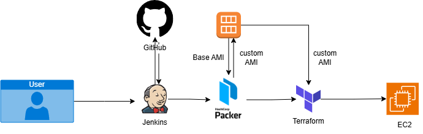

# GoldenImages

# 🛠️ NGINX AMI Provisioning and Infrastructure Automation with Terraform, Packer, and Jenkins

<p align="center">
  
</p>

This project automates the creation of an Amazon Machine Image (AMI) with NGINX installed using **Packer**, and provisions an EC2 instance using **Terraform**. The pipeline is triggered and managed via **Jenkins**, providing a full CI/CD infrastructure setup.

---

## 🧱 Project Structure
```
.
├── packer/
│ └── nginx-ami.pkr.hcl # Packer template to build AMI
├── terraform/
│ ├── main.tf # Terraform config for EC2 and null_resource to run Packer
│ ├── provider.tf # Input variables
│ └── outputs.tf # Output values
├── Jenkinsfile # Jenkins pipeline definition
└── README.md
```

---

## ⚙️ Prerequisites

- AWS Account (IAM user with EC2 and AMI privileges)
- Jenkins installed (Windows or Linux)
- AWS CLI installed and configured
- Terraform and Packer installed on Jenkins agent
- GitHub repository (for source code)

---

## 🛠️ Jenkins Setup

### 1. Add AWS Credentials to Jenkins

Go to: **Jenkins > Manage Jenkins > Credentials > Global**  
Add the following:

- **Secret Text**  
  - ID: `aws-access-key-id`  
  - Secret: your AWS Access Key ID

- **Secret Text**  
  - ID: `aws-secret-access-key`  
  - Secret: your AWS Secret Access Key

### 2. Add GitHub Credentials (for private repos)

- Kind: `Username with password`  
- ID: `github-creds`  
- Username: your GitHub username  
- Password: your GitHub personal access token

### 3. Create a Jenkins Pipeline Job

- Job type: **Pipeline**
- SCM: **Git**
- Repo URL: `https://github.com/your-user/your-repo.git`
- Script path: `Jenkinsfile`

---

## 🚀 What This Pipeline Does

1. **Clones the repo from GitHub**
2. **Initializes Terraform**
3. **Triggers a Packer build using a Terraform `null_resource`**
4. **Creates an EC2 instance using the new AMI**
5. **Outputs public IP**

---

## 🧪 How to Trigger

1. Run the Jenkins job normally for provisioning.
2. Use the **`DESTROY_INFRA` checkbox** to destroy infrastructure.
